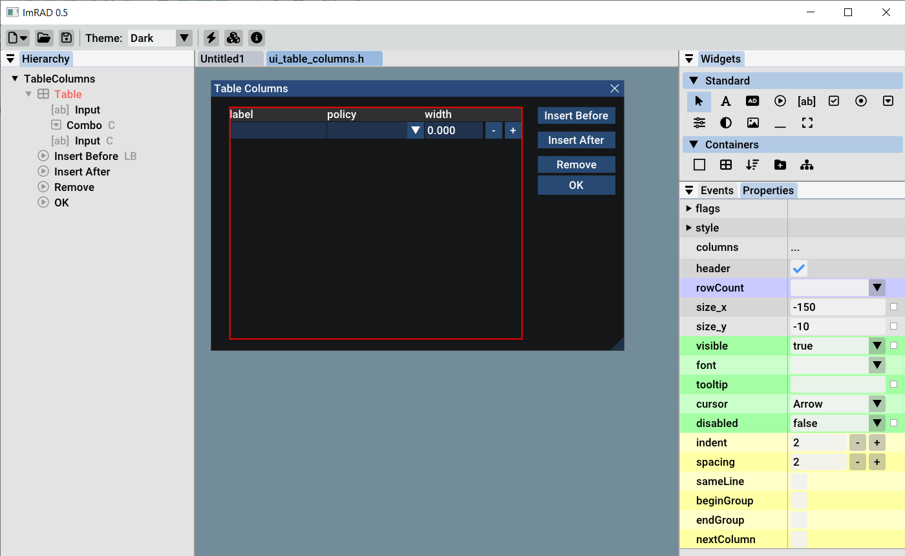

# ImRAD

ImRAD is a GUI builder for the ImGui library. It generates and parses C++ code.  

ImRAD runs on Windows and Linux. 

# Features

ImRAD is under active development but these are the main features:

* supports wide range of widgets (WIP)
  
  * basic widgets like Text, Checkbox, Combo, Button
  * container widgets like Child, Table, CollapsingHeader

* generates layout using SameLine/Spacing/NextColumn/BeginGroup instead of absolute positioning 
  
  * This ensures widgets respect item spacing and frame padding in a consistent way
  * There is a clear relationship between parent - child widget as well as children ordering which is important for container widgets like Table

* supports property binding 
  
  * class variables can be managed through simple class wizard or from binding dialog
  * property binding is important because ImGui is immediate mode GUI library so widget states like input text or combobox items must be set at the time of drawing from within the generated code. 
  * using property binding generated UI becomes dynamic and yet it can still be designed at the same time  

* supports generating event handlers and other support code
  
  * for example modal dialog will generate OpenPopup member function with a lambda callback called when dialog is closed
  * event handlers allow event handling user code to be separated from the generated part so the designer still works

* generated code is delimited by comment markers and user is free to add additional code around and continue to use ImRAD at the same time
  
  * advanced widget positioning can be implemented this way - see the calculator example (todo)

* generated code is ready to use in your project and depends only on ImGui library and one accompanying header file (imrad.h)
  
  * for Image widget imrad.h takes an optional dependency to stb and GLFW libraries. This can be activated by defining IMRAD_WITH_GLFW_TEXTURE project wide
  * you are free to supply your own texture loading code if you target different backed 

* ImRAD tracks changes to the opened files so files can be designed in ImRAD and edited in your IDE of choice at the same time
  
  * maybe the auto-save feature would be useful to have 

# License

* ImRAD source code is licensed under the GPL license 
* Any code generated by the tool is excluded from GPL and can be included in any project either open-source or commercial and it's up to the user to decide the license for it. 
* Additionally since imrad.h is used by the generated code it is also excluded from the GPL license  

# Download binaries

for up-to date version clone & build the repository using CMake. There are no nightly builds at the moment. 

[Releases](https://github.com/tpecholt/imrad/releases)

# Screenshots

# More information

Please check [wiki](https://github.com/tpecholt/imrad/wiki) for tutorials and more detailed content

# Credits

Design and implementation - [Tomas Pecholt](https://github.com/tpecholt)
Thanks to [Omar Cornut for Dear ImGui](https://github.com/ocornut/imgui)